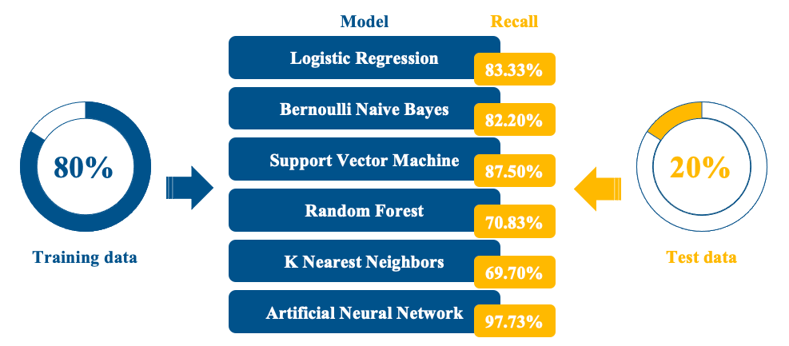
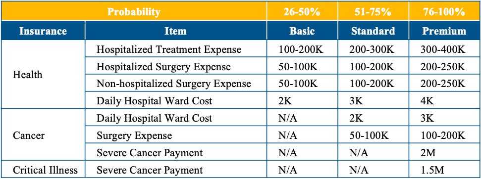

# Lung Cancer Prediction in Insurance based on Machine Learning 🤖️

I used lung cancer dataset with 7 Machine Learning algorithms to predict probability a person would suffer from Lung Cancer, and applied model to insurance planning procedure with 3 main recommendations. 

## Purpose

The purpose of this study is to develop a disease prediction model using lung cancer as the disease target, in order to assist the sales agents to provide customization in insurance planning for lung cancer, in order to differentiate from most agents who tend to make fixed recommendations.😊 

## Procedure. 

### 1.Dataset:
A public dataset of lung cancer patient, which consists of 309 samples, 15 explanatory variables, and 1 response variable, is available on UC Irvine’s Machine Learning Repository. 

### 2.Data Preprocessing: 
dropping duplicates, one hot encoding for gender, label encoding for lung cancer and standardization.  

### 3.Modeling: 
7 models are trained by 80% of samples and evaluated by the rest; among them, Artificial Neural Network (ANN) possesses highest Recall of 97.73% and therefore becomes selected model.  

### 4.Application: 
Probability of a client’s lung cancer development, which is predicted by our trained ANN model, is further applied to insurance planning with 3 main recommendations.  

## Project

If you want to read my study, please click this : 🔗 [here](doc/Project_ChelseaYeh.pdf). 

Thanks for reading! 😄
