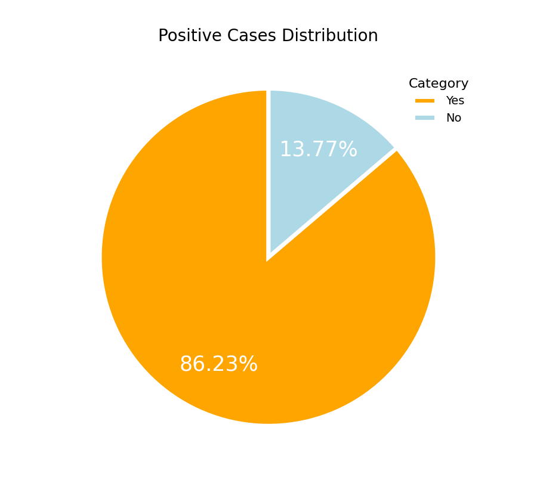
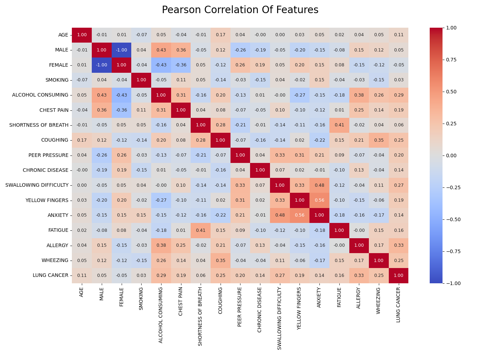

# 🤖️ Lung Cancer Prediction in Insurance based on Machine Learning 

A machine learning-based tool that predicts lung cancer risk using survey data and recommends insurance plans tailored to risk levels.

## 1. Project Overview
This project aims to:
- Predict the likelihood of lung cancer based on lifestyle and symptom inputs
- Address class imbalance using SMOTE and class_weight
- Recommend customized insurance coverage based on risk probability

Target audience includes:
- Individuals concerned about lung health
- Insurance companies wanting to personalize offerings
- Health data scientists interested in medical risk modeling

## 2. Data Summary

- Source: UCI's Machine Learning Respository
- Records: 309
- Target: LUNG CANCER (Yes/No)
- Input features: 15 (e.g., Age, Gender, Smoking, Wheezing, Chest Pain)

## 3. EDA Visualization
- Distribution of Lung Cancer labels

- Correlation heatmap between features and target

> For full EDA and statistical tests, see: `notebook/eda.ipynb`.

## 4. Modeling Pipeline
### Preprocessing
- Data cleaning (whitespace, dtypes, encoding)
- One-hot encoding for gender
- Feature selection based on statistical relevance
- Standardization with StandardScaler

### Models Trained: 
- Logistic Regression (balanced)
- Random Forest (balanced)
- SVM (class weight)
- XGBoost (scale_pos_weight)
- Correlation heatmap between features and target
> ROC Curve saved to: `images/roc_curve.png`

### Model Selection Logic
To prioritize **minimizing false negatives**, the final model is selected based on:
- Recall (50% weight)
- AUC (25%)
- F1 Score (15%)
- Accuracy + Precision (10%)

## 5. Insurance Application


## 6.Folder Structure
```
lung-cancer-prediction/
├── data/                       # Input survey data
├── modules/                    # Python modules
│   ├── preprocessing.py        # Clean, encode, scale
│   ├── modeling.py             # Train, evaluate, select 
│   └── application.py          # Input collection, prediction, insurance logic
├── images/                     # ROC plots, EDA images, insurance portfolio
├── notebook/
│   └── eda.ipynb               # EDA
├── report/                     # Analysis Report in Chinese
├── main.py
├── .gitignore                  # Excludes data files, environments, etc.
└── README.md
```

Thanks for reading! 😄
